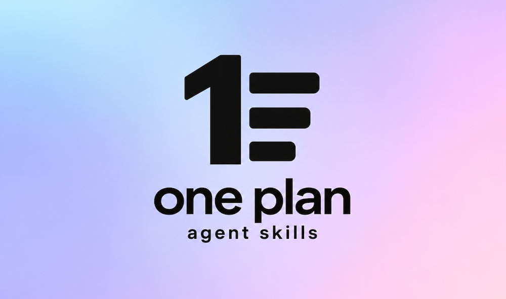

<p align="center">
  
</p>

# one-plan-skills

**Just one** `PLAN.md`**. Agent Skills for lightweight spec-driven development.**

One Plan - a collection of agent skills ([spec](https://agentskills.io/specification)) to generate a `PLAN.md` file with detailed tasks.

It works with any agent that supports the Agent Skills format _(Claude Code, Cursor, Codex CLI, GitHub Copilot, Gemini CLI, etc)_.

## Core idea

> One feature, one `PLAN.md`. Simple workflow for agentic engineering and SDD.

Agentic engineering needs structure and simplicity. With **One Plan**, all your work is stored in one `.md` file. No more dozens of markdown files, specs and folders.

[Spec-driven development](https://martinfowler.com/articles/exploring-gen-ai/sdd-3-tools.html) without the overhead. Your spec and tasks in one place. Agents execute. You stay in control.

The core idea resolves around the concept of single disposable plan for a feature.

- **One feature, one plan.** Create `PLAN.md` when you start a feature and throw it away when the feature is done. There's no need to commit it; the code and its tests are what stay.
- **Every task is verifiable.** Each task has acceptance criteria, and the agent checks them against the code before marking the task done.
- **Your pace.** Let the agent implement the whole plan in one go, or go task by task so each change stays small and easy to review.
- **Saved progress.** Do some work and come back later. Open new session in any coding agent and it will continue where you left off.
- **Visual plan review.** The agent builds a `PLAN.html` page that you can review in the browser. Instead of looking at boring markdown files, you can comfortably review the plan and collaborate with the agent by copy-pasting feedback to the chat.

Check out the [live demo](https://vguleaev.github.io/one-plan-skills/examples/PLAN.html) to see how it works.

## Install

```sh
npx skills add vguleaev/one-plan-skills --skill '*'
```

## Skills

| Skill                 | What it does                                                           | Example                                 |
| --------------------- | ---------------------------------------------------------------------- | --------------------------------------- |
| `one-plan-init`       | Create `PLAN.md` for a feature, with tasks and acceptance criteria     | `/one-plan-init Implement OAuth2 login` |
| `one-plan-review`     | Build an HTML review page from `PLAN.md` and collect per-task feedback | `/one-plan-review`                      |
| `one-plan-start-task` | Work on a task, ticking criteria as they are met                       | `/one-plan-start-task T-002`            |
| `one-plan-check-task` | Verify a task's criteria and mark it done                              | `/one-plan-check-task T-002`            |
| `one-plan-add-task`   | Add a task to an existing `PLAN.md`                                    | `/one-plan-add-task Configure Tailwind` |

_To invoke a skill, use the `/skillName` syntax of Claude Code and Cursor. In Codex, use `$skillName`._

## Usage

The skills follow a simple agentic engineering loop: **Plan → Review plan → Give feedback → Implement**. You stay in control of what gets built, and the agent does the typing.

Your journey starts with a skill to create a plan `.md` file.

1. Plan a feature:

```
 /one-plan-init Implement OAuth2 login
```

2. Review the plan in the browser, approve tasks or request changes, and paste the feedback back into the chat:

```
 /one-plan-review
```

3. Work on a task:

```
 /one-plan-start-task T-001
```

4. Confirm it is finished:

```
 /one-plan-check-task T-001
```

You can also just ask in plain words, for example "Start working on T-003 and check whether T-002 is done".

## What's in Plan?

- A **Progress Tracker** table with every task and its status (`🔲 TODO` or `✅ DONE`)
- A section per task with a unique `T-<number>` ID, a description and acceptance criteria as checkboxes
- An optional **Files affected** list per task, with the new or changed code
- A **Notes** section for decisions and scope

## Examples

- [examples/PLAN.md](examples/PLAN.md): a plan created with `one-plan-init` and worked through with the other skills.
- [Live review page](https://vguleaev.github.io/one-plan-skills/examples/PLAN.html): the `PLAN.html` that `one-plan-review` builds from it.

## Keep progress up to date

`one-plan-init` offers to add a short rules snippet to your `AGENTS.md` or `CLAUDE.md`, so the agent ticks criteria and marks tasks done even when you don't call a skill. You can also paste [the snippet](skills/one-plan-init/assets/agent-rules-snippet.md) yourself. This is optional, because every `PLAN.md` already carries its own Agent Instructions.

Learn more [here](https://agents.md/)

## Like it?

If one-plan helps you, give the repo a ⭐ on [GitHub](https://github.com/vguleaev/one-plan-skills). It helps other people find it.

## License

MIT
